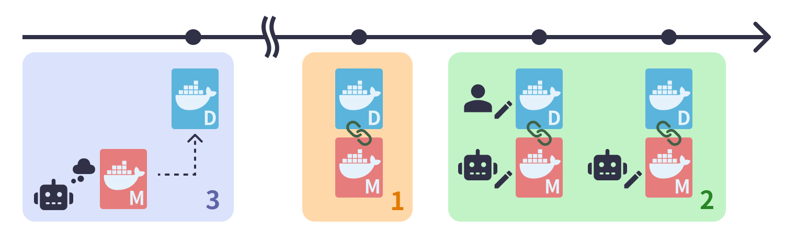
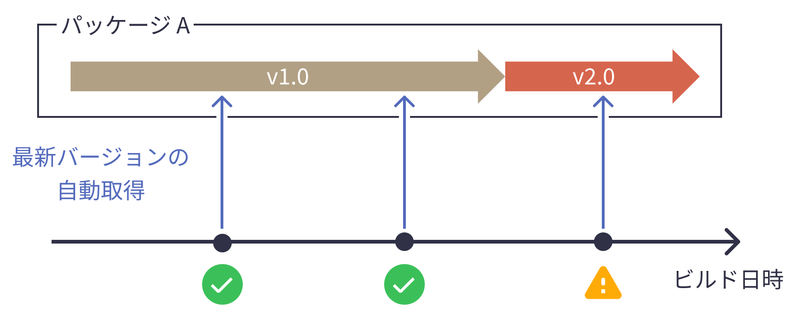
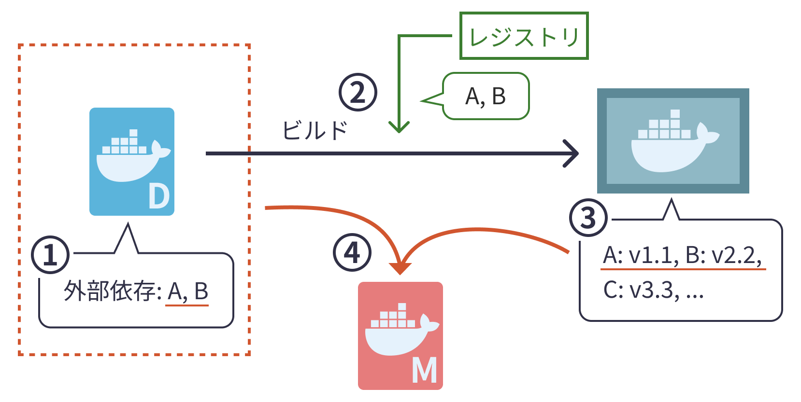
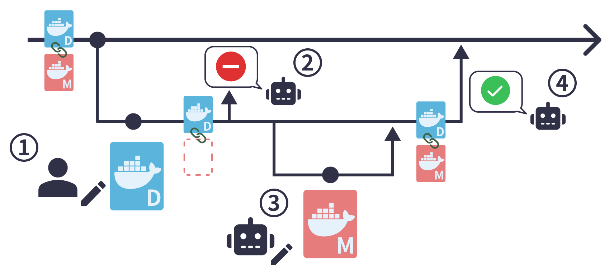
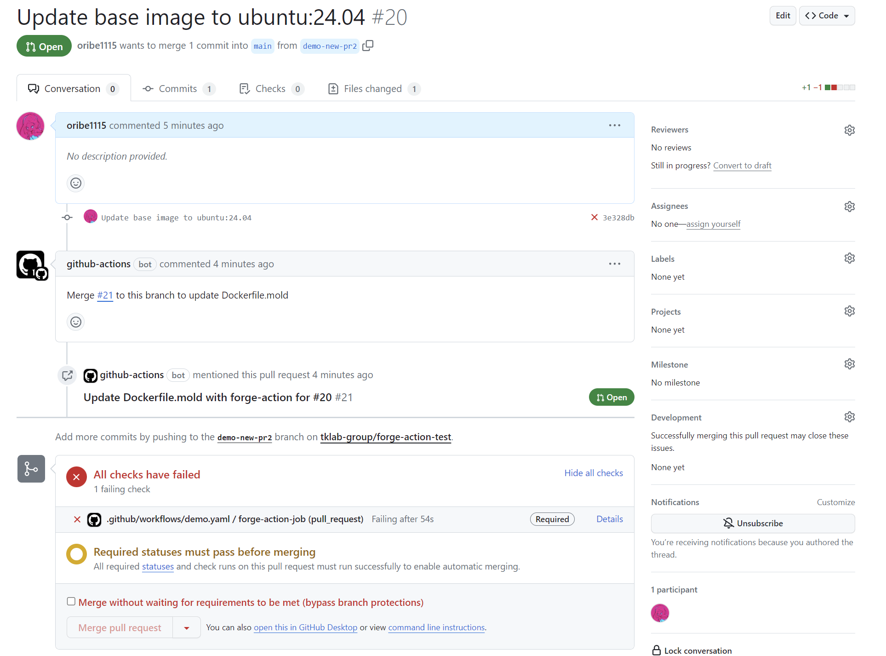
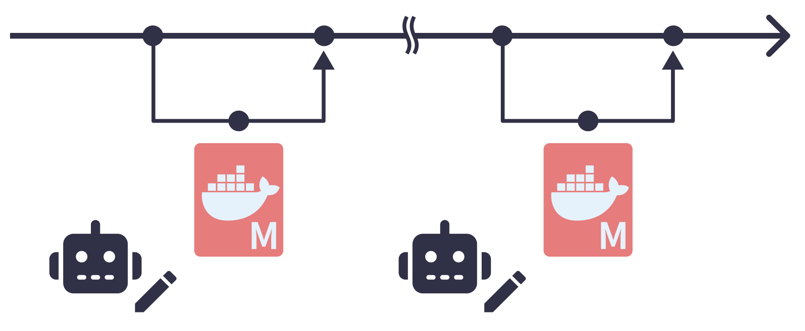
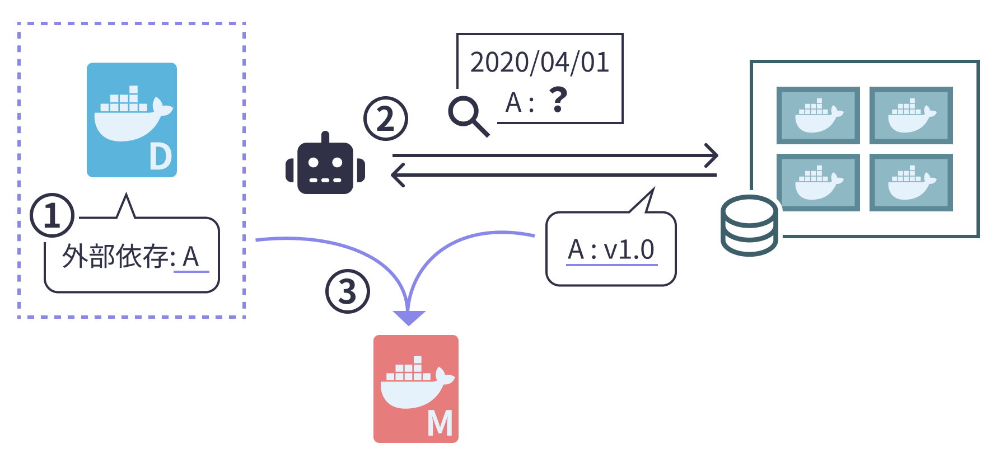

# CDCM

Continuous Dockerfile Configuration Management (CDCM)はDockerを用いた開発プロジェクトにおける、Dockerfileの構成再現性とビルド可能性の両立を目的とした構成管理プロセスです。

CDCMを支援するツールはこちらで公開しています。
- [forge](https://github.com/tklab-group/forge)
- [forge-action](https://github.com/tklab-group/forge-action)([GitHub Marketplace](https://github.com/marketplace/actions/forge-action))



## 背景

Dockerfileはベースイメージや、パッケージ管理ツール(e.g. apt)で取得するパッケージといった外部依存を持つ。
Dockerfileにおいては慣例的に、それらに対しての緩いバージョン指定による記述が用いられる。
例えば、ベースイメージイメージに対してはタグを、パッケージについてはバージョン指定を明記しないパッケージインストール記述を使用する。

```Dockerfile
# 一般的なDockerfile記述の例
FROM ubuntu:latest

RUN apt-get update && apt-get install -y \
    curl
```

しかし、このような記述を用いたDockerfileはビルドの時期によって取得される外部依存の実際のバージョンが変化する。
これはイメージのタグの付与対象が更新されることや、パッケージ管理ツールはデフォルトで実行時の最新バージョンを取得することによって起こる。



このような意図しない外部依存のバージョン変化はデグレーションを引き起こすことがある。
これはリポジトリの管理範囲外で起こるため、開発者は取得バージョンの切り替わりを認識することが難しく原因特定が困難となる。

Dockerfileではバージョン固定([version pinning](https://docs.docker.com/develop/develop-images/dockerfile_best-practices/))により取得する外部依存のバージョンを固定し、イメージの**構成再現性**を高めることができる。

```Dockerfile
# バージョン固定をしたDockerfile記述の例
FROM ubuntu@sha256:e6173d4dc55e76b87c4af8db8821b1feae4146dd47341e4d431118c7dd060a74

RUN apt-get update && apt-get install -y \
    curl=7.81.0-1ubuntu1.15
```

一方でバージョン固定をしたDockerfileは、長期的には対象バージョンの配信停止などの外部環境の変化により**ビルド可能性**が低下していく。

構成再現性とビルド可能性はトレードオフの関係にあり、両立は困難とされている。

## CDCMの提案

Dockerfileの構成再現性とビルド可能性の両立を目的として、新たな構成管理プロセス **Continuous Dockerfile Configuration Management (CDCM)** を提案した。
CDCMは3つの要素から構成される。

1. 開発者が作成したDockerfileに対応して生成する新ファイル形式**Moldfile**による、外部依存構成の厳密な記録
2. Moldfileの継続的な自動更新による、Dockerfileとの対応関係の最新状態の保持
3. 開発プロジェクトへのMoldfile導入前の、外部依存構成の記録 がない過去の状況に対しての外部依存構成の推定


### 1. Moldfile

MoldfileはCDCMで使用する独自のDockerfile互換のファイルである。
Moldfileは開発者が作成したDockerfileに基づいて自動生成され、外部依存のバージョンを厳格に記録する。

```diff
# Dockerfileと生成されたMoldfileの差分の例
-- Dockerfile
++ Moldfile

# ベースイメージ指定をタグからダイジェストに置き換え
-- FROM ubuntu:latest
++ FROM ubuntu@sha256:e6173d4dc55e76b87c4af8db8821b1feae4146dd47341e4d431118c7dd060a74

# パッケージへのバージョン指定の追加
RUN apt-get update && apt-get install -y \
--    curl
++    curl=7.81.0-1ubuntu1.15
```

CDCMではDockerfileとMoldfileを同一のGitリポジトリで管理するが、両者は異なる役割を担うう。
Dockerfileは開発者によって手動で作成、更新される。
ここではタグによるベースイメージ指定と詳細なバージョン指定を伴わないパッケージ取得記述を使用することで、可読性とメンテナンスの簡便さを維持する。
対してMoldfileはツールによって自動で作成、更新される。
Moldfileの役割はスナップショットとしての外部依存構成の厳密な記録になり、構成再現性の向上に貢献する。

Moldfileは外部環境の変化によってビルド可能性の低下が生じるが、この問題は[「2. 開発フローにおける継続的なMoldfileの運用」](#2-開発フローにおける継続的なmoldfileの運用)によって解決される。

#### Moldfileの生成

Moldfileの生成は以下の手順で行う。



1. Dockerfile上の外部依存を全て抽出する
1. Dockerfileを用いてイメージのビルドを行い、その時点で取得される外部依存のバージョンを確定させる
1. イメージを解析し、Dockerfileに記述されている外部依存の実際に取得されたバージョンを特定する
1. Dockerfileの記述に各外部依存を特定したバージョンで固定する記述を追加したテキストファイルをMoldfileとする

マルチステージビルドを用いたDockerfileに対しても、各ステージずつMoldfileの生成処理を適用することで全ての外部依存構成を記録したMoldfileの生成が可能である。

Moldfileの生成ツールの実装として[forge](https://github.com/tklab-group/forge)を公開している。

### 2. 開発フローにおける継続的なMoldfileの運用


CDCMでは、リポジトリにおいてDockerfileとMoldfileの対応関係が常に維持されていること、またMoldfileが最新でありいつでもビルド可能であることが重要である。
これを実現するためCDCMではMoldfileの継続的な運用として(1)Dockerfileの変更への自動追従、(2)定期的な更新、を実施する。

継続的なMoldfileの運用を支援するツールの実装として[forge-action](https://github.com/tklab-group/forge-action)を公開している。

### 2.1. Dockerfileの変更への自動追従

Dockerfileの変更への自動追従は、リポジトリの本流ブランチにおいてDockerfileの変更後もMoldfileとの整合性が取れた状態を維持し続けることを目的とする。



1. 開発者がDockerfileを変更すると、そのブランチ上ではMoldfileとは不整合が発生する
1. この対応関係の不整合を検知するとツールは本流ブランチへのこの開発者のブランチのマージを禁止する
1. ツールは変更後のDockerfileを元にMoldfileの再生成を自動で行う
1. 開発者のブランチは再生成されたMoldfileを取り込むことによって再び整合性が取れた状態となるため、ツールはマージのブロックを解除する


forge-actionでは、マージの禁止とMoldfileが再生成されたことの通知を図のように実現する。



### 2.2. Moldfileの自動定期更新

Moldfileの自動更新は、リポジトリ上のMoldfileが常にビルド可能かつ外部依存が最新な状態の維持を目的とする。



Moldfileは既存のアプローチと同様、外部環境の変化によってビルド可能性が低下していく。
また外部依存の使用に際しては、機能追加やセキュリティパッチの適用がされた新しいバージョンに自動で追従したいという要求がある。
ビルド可能性の維持と新バージョンへの追従を実現するために、CDCMでは定期的にMoldfileの再生成を実行し取得される外部依存のバージョンに変化がないかを確認する。
変化があった場合は新たに作成したMoldfileを本流ブランチへマージし、使用バージョンの変更を反映する。

Moldfileの更新はDockerfileの記述によって取得される外部依存が変化したことの通知にもなるため、開発者がDockerfileの記述を見直すきっかけにもなる。


### 3. 過去の時点のMoldfileの推定生成

Moldfileの導入以後は構成再現性が保証されるが、導入以前の時期は外部依存構成の記録がないため構成再現が困難である。
そこでCDCMは任意の時点のMoldfileの推定生成により、導入以前の時期に対しても構成再現を可能にする。
ここでは同時期にビルドされたイメージでは同じ外部依存に対しては同一のバージョンが取得されているという仮定に基づいて、推定の情報源として他プロジェクトのイメージを使用する。

Moldfileの推定生成は以下の手順で行う。



1. Dockerfile上の外部依存を抽出する。
1. 各外部依存に対し、他プロジェクトのイメージでのバージョン利用実績を問い合わせる。
1. Dockerfileの記述に得られたバージョン情報を追加したテキストファイルを作成し、Moldfileとする。

バージョン利用実績の問い合わせでは、複数のバージョンが候補として得られることがある。
これは同時期にビルドされたイメージに、古いバージョンを固定して使っているものや、ベースイメージから継承した古いバージョンのパッケージが残っているものがある場合に発生する。
推定対象のDockerfileにバージョン指定記述がなければビルドして得られるのは当時の最新バージョンである。
そのため候補のうち最も新しいバージョンが当時の最新バージョンであるとみなし、推定結果に採用する。

Moldfileの推定生成を支援するパッケージ利用実績のデータベースは現在公開していない。
